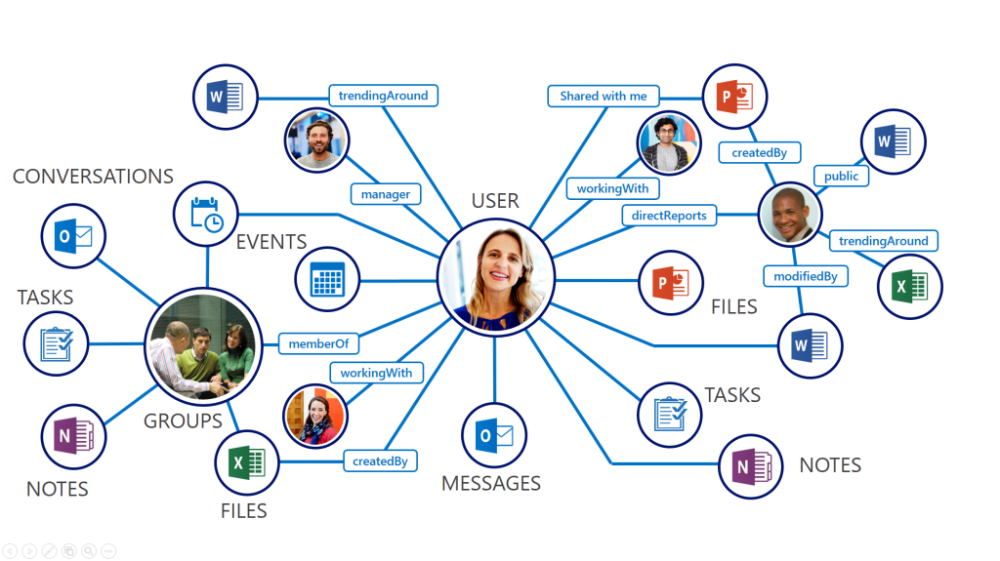
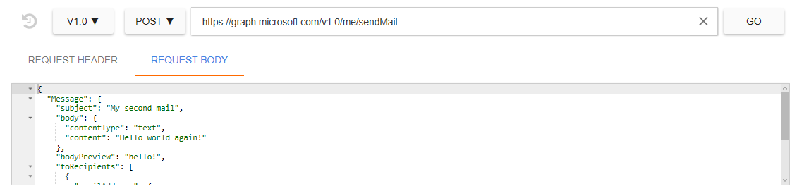

# Overview of Microsoft Graph

 API endpoint

```http
GET https://graph.microsoft.com/v1.0 HTTP/1.1
```
Microsoft Graph API is a RESTful interface that is used to interact with data in the Microsoft cloud. You can use Microsoft Graph in your applications to read, write, and traverse your users' data through a single endpoint. Here's is what the Graph is made of:

**Nodes** are the objects you interact with, like users, groups, mail, calendar, files. Each node contains information about that node like *displayName* and *id*, stored as properties.

**Edges** are the connections between the nodes, like *isMemberOf* between a user and a group, and *isOwnerOf* between a user and a file.



In this overview, you will learn how to send a mail and browse your drive using Microsoft Graph through the Graph Explorer.

## Introducing the Graph Explorer
The Graph Explorer is a simple way to get started with Microsoft Graph. Simply put, this is just a web app built on top of Microsoft Graph that takes in your HTTP requests and returns live responses right through the browser. All you have to do is sign in, and it will handle all the token exchanges to make your requests work.

To learn more about obtaining and using tokens, go to **Managing your access token through REST**

### API Versioning

In Graph Explorer, you will choose which version of Microsoft Graph you will use.
- v1.0 is the production ready tier of Graph. We promise no breaking changes as more features are added.
- beta is the experimental tier of Graph. Features will be added here and then pushed to a production ready tier or otherwise removed. It is recommended you don't write production code against beta.

## Send a mail

> NOTE THIS MESSAGE WAS MARKED AS SPAM IN GMAIL. NEED TO FIGURE OUT WHY.

```http
POST https://graph.microsoft.com/v1.0/me/sendMail HTTP/1.1
{
  "Message": {
    "subject": "My second mail",
    "body": {
      "contentType": "text",
      "content": "Hello world again!"
    },
    "bodyPreview": "hello!",
    "toRecipients": [
      {
        "emailAddress": {
          "name": "Vivian",
          "address": "viv.liu25@gmail.com"
        }
      }
    ]
  }
}
```
Sign into Graph Explorer using your Microsoft account (Outlook, Live, Hotmail) or Office365 account **if you are an administrator (because they have to consent to Graph Explorer).** Select v1.0 and POST from the dropdowns, and enter the following request and body.



Hit Go.

Congrats, you just sent your first mail using Microsoft Graph!

The response contains an HTTP status code to tell you the success or failure state of your request. To learn more about error codes and some of the causes, visit **Errors**.

MVP for setting up a tenant/MSA?
What works for MSA "tenant" vs AAD tenant?  

## Browse your drive

```http
GET https://graph.microsoft.com/v1.0/drives HTTP/1.1
```

Make sure you are signed into Graph Explorer.
Select v1.0 and GET from the dropdowns, and enter the following request URL.

Hit Go.

This lets you see the OneDrive documents you have under this account. You can create a new folder, navigate through folders, and download files through **a OneDrive tutorial**.

# Authentication

> To authorize, use this code:

```ruby
require 'kittn'

api = Kittn::APIClient.authorize!('meowmeowmeow')
```

```python
import kittn

api = kittn.authorize('meowmeowmeow')
```

```shell
# With shell, you can just pass the correct header with each request
curl "api_endpoint_here"
  -H "Authorization: meowmeowmeow"
```

```javascript
const kittn = require('kittn');

let api = kittn.authorize('meowmeowmeow');
```

> Make sure to replace `meowmeowmeow` with your API key.

Kittn uses API keys to allow access to the API. You can register a new Kittn API key at our [developer portal](http://example.com/developers).

Kittn expects for the API key to be included in all API requests to the server in a header that looks like the following:

`Authorization: meowmeowmeow`

<aside class="notice">
You must replace <code>meowmeowmeow</code> with your personal API key.
</aside>

# Kittens

## Get All Kittens

```ruby
require 'kittn'

api = Kittn::APIClient.authorize!('meowmeowmeow')
api.kittens.get
```

```python
import kittn

api = kittn.authorize('meowmeowmeow')
api.kittens.get()
```

```shell
curl "http://example.com/api/kittens"
  -H "Authorization: meowmeowmeow"
```

```javascript
const kittn = require('kittn');

let api = kittn.authorize('meowmeowmeow');
let kittens = api.kittens.get();
```

> The above command returns JSON structured like this:

```json
[
  {
    "id": 1,
    "name": "Fluffums",
    "breed": "calico",
    "fluffiness": 6,
    "cuteness": 7
  },
  {
    "id": 2,
    "name": "Max",
    "breed": "unknown",
    "fluffiness": 5,
    "cuteness": 10
  }
]
```

This endpoint retrieves all kittens.

### HTTP Request

`GET http://example.com/api/kittens`

### Query Parameters

Parameter | Default | Description
--------- | ------- | -----------
include_cats | false | If set to true, the result will also include cats.
available | true | If set to false, the result will include kittens that have already been adopted.

<aside class="success">
Remember — a happy kitten is an authenticated kitten!
</aside>

## Get a Specific Kitten

```ruby
require 'kittn'

api = Kittn::APIClient.authorize!('meowmeowmeow')
api.kittens.get(2)
```

```python
import kittn

api = kittn.authorize('meowmeowmeow')
api.kittens.get(2)
```

```shell
curl "http://example.com/api/kittens/2"
  -H "Authorization: meowmeowmeow"
```

```javascript
const kittn = require('kittn');

let api = kittn.authorize('meowmeowmeow');
let max = api.kittens.get(2);
```

> The above command returns JSON structured like this:

```json
{
  "id": 2,
  "name": "Max",
  "breed": "unknown",
  "fluffiness": 5,
  "cuteness": 10
}
```

This endpoint retrieves a specific kitten.

<aside class="warning">Inside HTML code blocks like this one, you can't use Markdown, so use <code>&lt;code&gt;</code> blocks to denote code.</aside>

### HTTP Request

`GET http://example.com/kittens/<ID>`

### URL Parameters

Parameter | Description
--------- | -----------
ID | The ID of the kitten to retrieve
